# BerlinCottbus-SpreeRegion-ArcGIS-VectorData-
Vector Data Ecosystem Analysis with ArcGIS on Berlin-Cottbus Spree region.

```
title: "Ecosystem Analysis Vector Data Berlin-Cottbus Spree region"
author: "Konlavach"
date: "2/23/2021"
```

## The spatial extend of the case study region is defined by four counties and one city:
### 1)	Spree-Neiße
### 2)	Oberspreewald-Lausitz
### 3)	Dahme-Spreewald
### 4)	Oder-Spree
### 5)	Cottbus

## Data source:
### 1)	European Union
### 2)	German Federal Institutions
### 3)	State of Brandenburg
### 4)	OpenStreetMap
### 5)	GoogleEarth, GoogleMap

## Project objectives:
### 1) Calculate area of counties
### 2) Calculate area of water protection
### 3) Count number of groundwater measurement station
### 4) Area of forest within a distance of 500 m to water bodies (lakes, rivers)
### 5) Georeference and Google basemap

# Part 1: Preprocessing

## Step 1: Download Shapefile 
### Source: 

```
Data source: German Federal Agency for Cartography and Geodes public data for Germany (GeoDataCentre)
Administrative borders: VG250 Germany
Land use model: DLM250
```

## Step 2: Add Shapefile

### Add shapefile 
```
Layer -> Add Data -> Select "German county polygons: vg250_kr.shp"
```

### Add shapefile to legend
```
Legend -> Properties
```
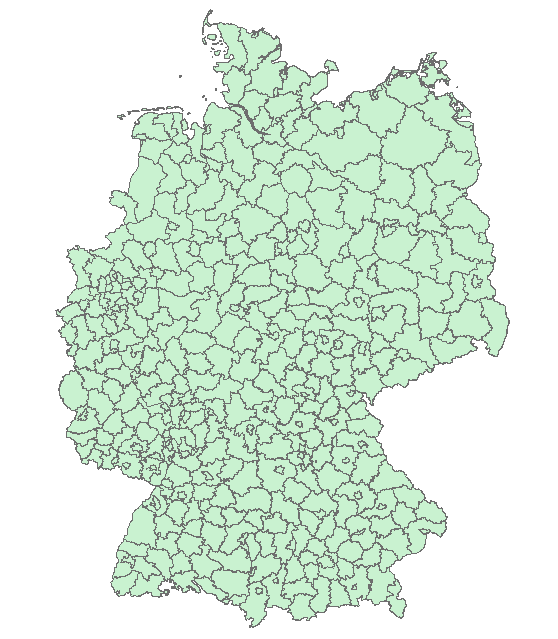<!-- -->

## Step 3: Select relevant county polygons

```
- Open attribute table
- Choose counties: SpreeNeiße, OberspreewaldLausitz, DahmeSpreewald, OderSpree, Cottbus
- Brandenbur counties regional key = 12xxx
- Select
```
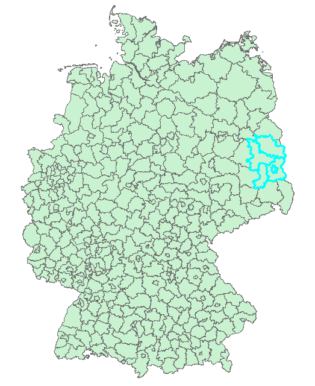<!-- -->

## Step 4: Copy selected features
```
ArcToolBox -> Data Management -> Features -> Copy Feature
```

## Step 5: Update visualization
```
Properties -> Symbology -> Standard symbols -> Categories -> unique values
```
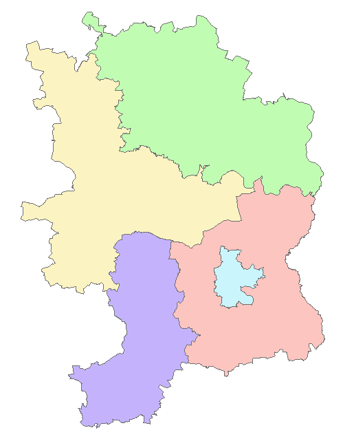<!-- -->

## Step 6: Dissolve all counties 
```
Geoprocessing -> Dissolve
```
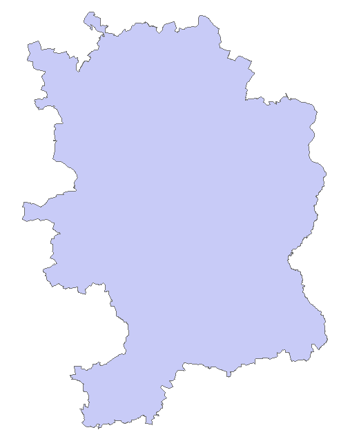<!-- -->

## Step 7: Add additional shapefiles
### 1) Water network
### 2) Lakes
### 3) Water protection area
### 4) Groundwater measurement stations
### 5) Land cover 

```
Layer -> Add Data -> files.shp -> crs WGS84
Geoprocessing -> Clip
```

### 1) Water network
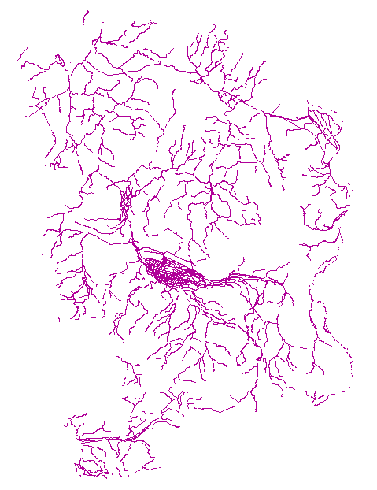<!-- -->

### 2) Lakes
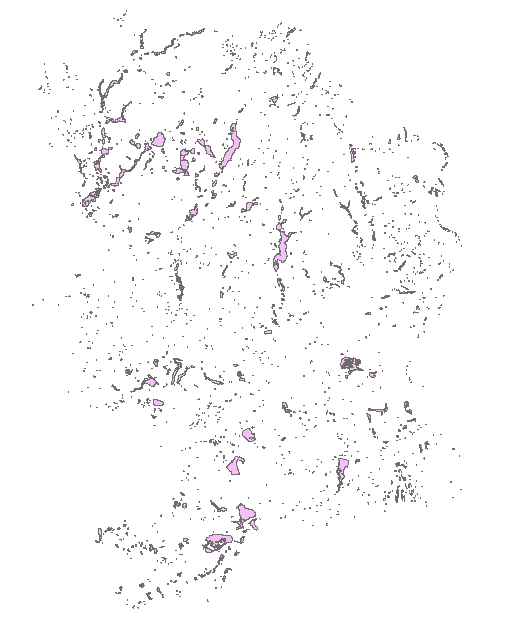<!-- -->

### 3) Water protection area
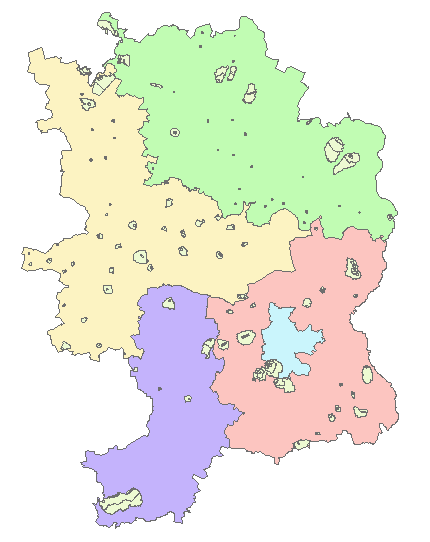<!-- -->

### 4) Groundwater measurement stations
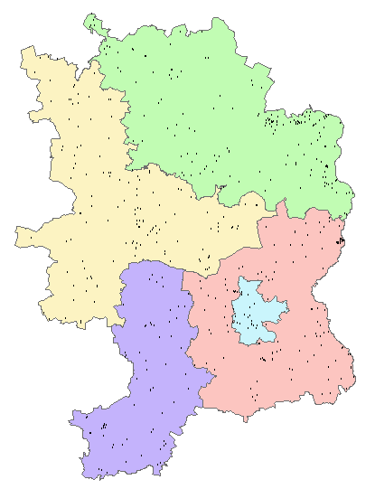<!-- -->

### 5) Land cover 
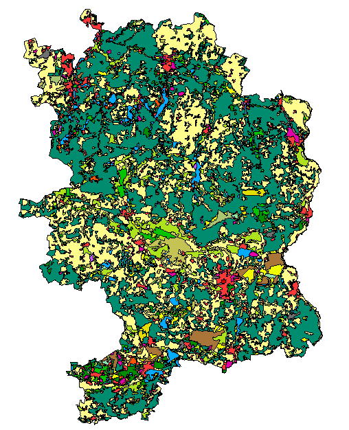<!-- -->


# Part 2: Calculate areas

## Step 1: Area of whole study area
```
Dissolved layer -> Open Attribute Table -> Add Field -> Floating point value -> Calculate Geometry 
```
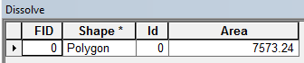<!-- -->


## Step 2: Area of the counties and city of Cottbus
```
Counties layer -> Open Attribute Table -> Add Filed -> Floating point value -> Calculate Geometry
Calculate percentage land cover
```
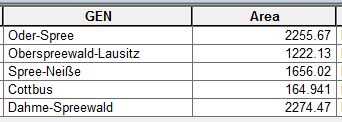<!-- -->


## Step 3: Area of Water Protection areas
```
ArcGIS = Selection operation
QGIS = Dissolve operation

Water Protection layer -> Open Attribute Table -> Add Filed -> Floating point value -> Calculate Geometry

Statistics -> Each counties
```
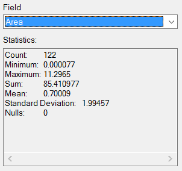<!-- -->
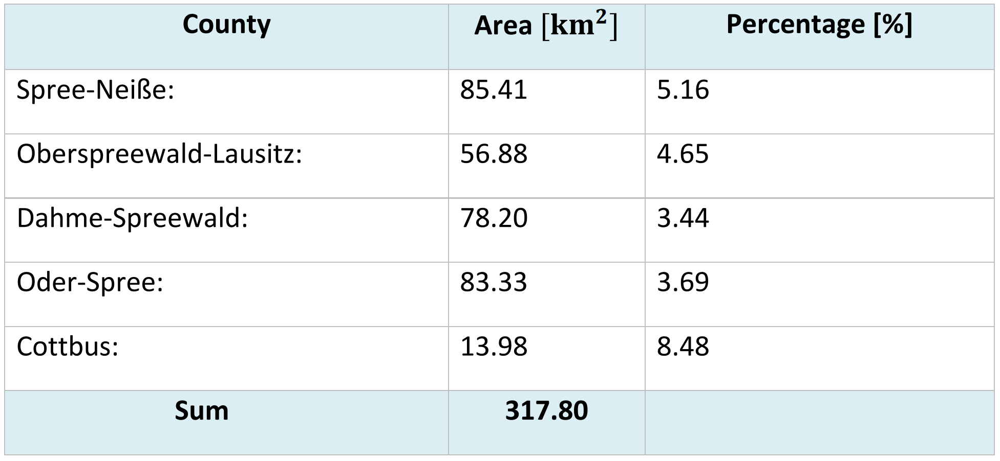<!-- -->

## Step 4: Number of groundwater measurement station in each counties
```
1) Geoprocessing -> Intersect 
(OR)
2) ArcToolBox -> Analysis Tools -> Overlay -> Intersect
```

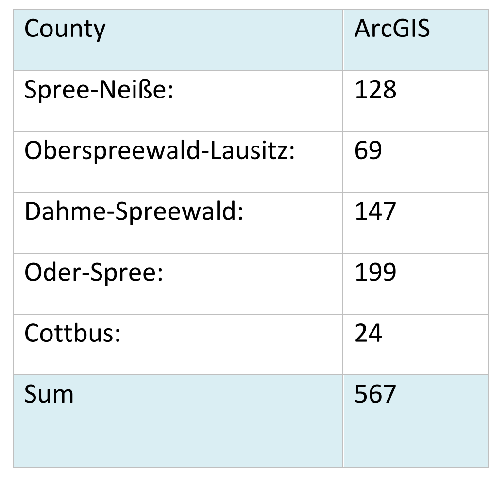<!-- -->


